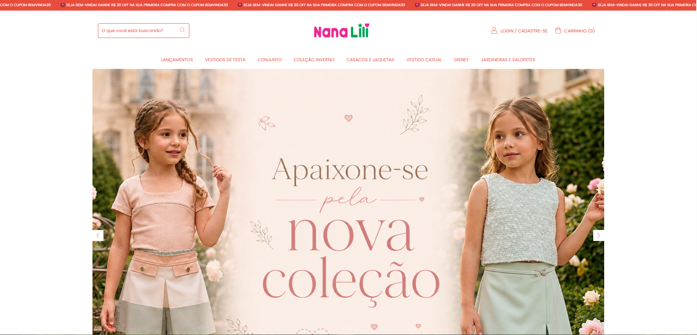
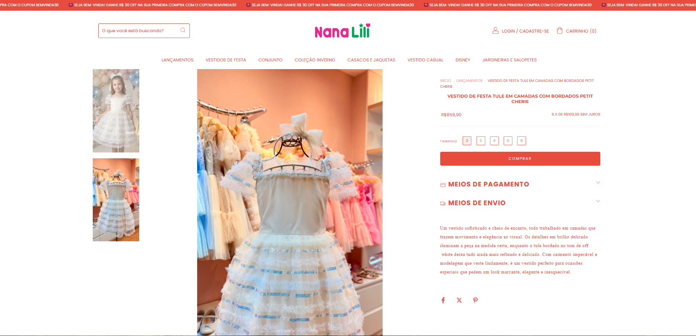
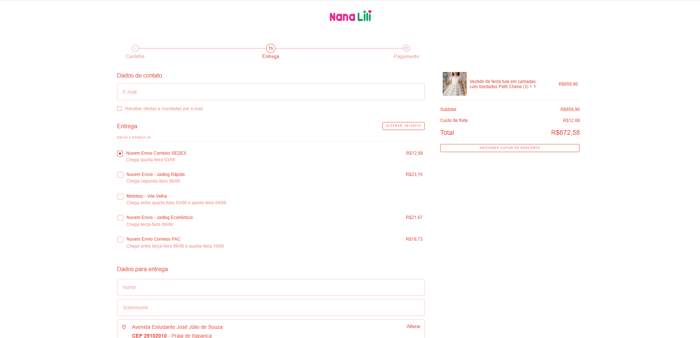
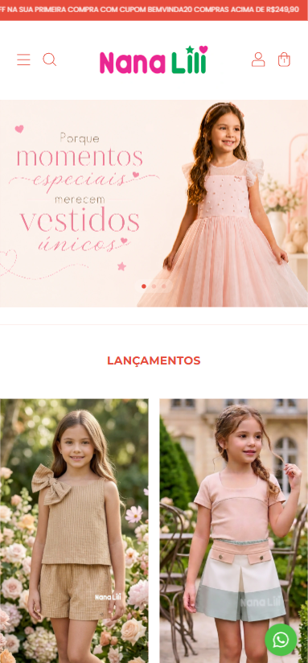
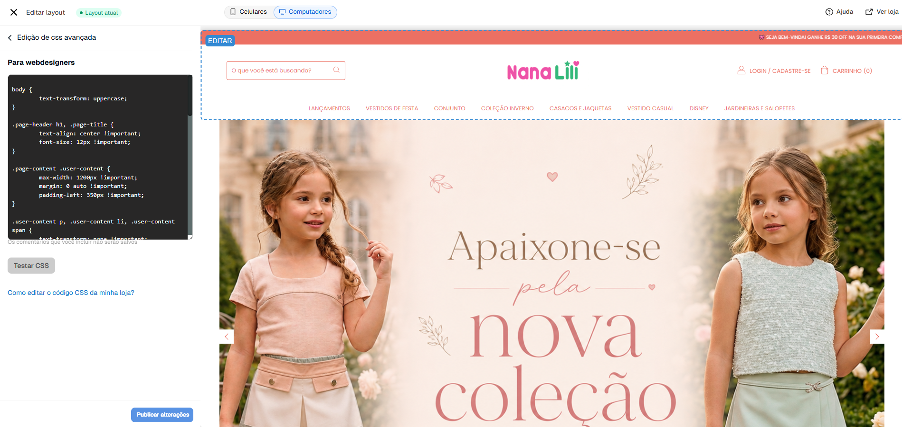
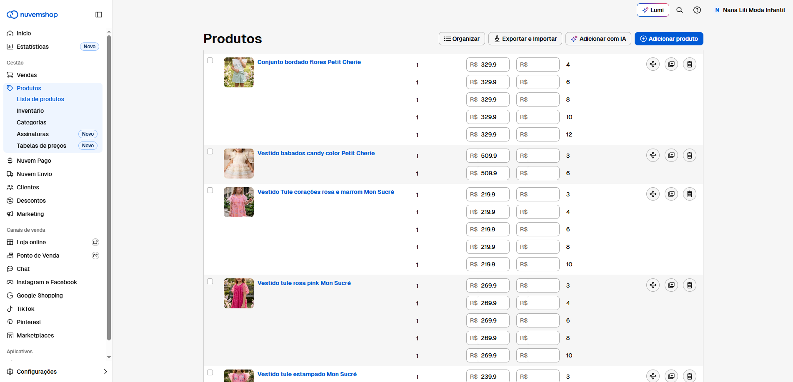

# 🛍️ Nana Lili Moda Infantil

Projeto de implementação e personalização de e-commerce desenvolvido para uma loja real de moda infantil, com foco em experiência do usuário, identidade visual, navegação intuitiva e otimização para dispositivos móveis.

🔗 Site: https://nanalilimodainfantil.com.br

---

# 📖 Sobre o Projeto

A Nana Lili Moda Infantil é uma loja especializada em roupas infantis. O objetivo deste projeto foi criar uma presença digital profissional, organizada e visualmente agradável, permitindo que clientes encontrem produtos com facilidade e realizem compras de forma simples e intuitiva.

O projeto envolveu desde a configuração da loja virtual até ajustes visuais, organização de categorias, banners promocionais e adaptação para dispositivos móveis.

---

# 🎯 Objetivos

- Criar uma experiência de navegação simples e agradável;
- Fortalecer a identidade visual da marca;
- Melhorar a apresentação dos produtos;
- Facilitar o contato com clientes;
- Garantir boa experiência em smartphones e desktops;
- Preparar a loja para crescimento futuro.

---

# 🛠️ Tecnologias e Ferramentas

- Nuvemshop
- HTML
- CSS
- Figma
- GitHub

---

# ✨ Funcionalidades Implementadas

- Estrutura completa de e-commerce;
- Organização de categorias;
- Destaque para lançamentos;
- Banners promocionais;
- Integração com WhatsApp;
- Layout responsivo;
- Navegação otimizada para dispositivos móveis;
- Personalização visual da loja;
- Ajustes de usabilidade;
- Organização do catálogo de produtos.

---

# 📸 Demonstração

## Página Inicial

---

## Página de Produto

---

## Carrinho

---

## Versão Mobile

---

## Edição e Estilização

---

## Catálogo

---

# 🎨 Identidade Visual

O projeto foi desenvolvido buscando transmitir:

- Delicadeza;
- Organização;
- Confiança;
- Facilidade de navegação;
- Experiência agradável para pais e responsáveis.

A paleta de cores, tipografia e disposição dos elementos foram adaptadas para refletir a proposta da marca.

---

# 📈 Principais Desafios

Durante o desenvolvimento foram realizados ajustes para:

- Melhorar a disposição dos produtos;
- Adaptar a experiência para dispositivos móveis;
- Organizar categorias e menus;
- Ajustar banners e elementos visuais;
- Garantir consistência visual em toda a loja.

---

# 🚀 Aprendizados

Este projeto proporcionou experiência prática em:

- Implementação de e-commerce;
- Design de interfaces;
- Experiência do usuário (UX);
- Responsividade;
- Organização de catálogo;
- Personalização de plataformas de venda online;
- Comunicação com cliente real;
- Levantamento de requisitos;
- Resolução de problemas em ambiente de produção.

---

# 💼 Projeto Real

Este projeto foi desenvolvido para uma empresa real e utilizado em ambiente de produção.

Além da parte técnica, houve contato direto com necessidades de negócio, tomada de decisões visuais e adaptações para atender aos objetivos da loja.

---

# 👨‍💻 Desenvolvedor

**Antony Novais Nunes**

Estudante de Ciência da Computação pela UVV.

Atualmente em busca da primeira oportunidade profissional na área de tecnologia, desenvolvendo projetos voltados para desenvolvimento web, automação, dados e soluções digitais.

### Contato

- LinkedIn: https://www.linkedin.com/in/antonynovais/
- GitHub: https://github.com/ognovais

---

# 🌐 Acesso ao Projeto

🔗 https://nanalilimodainfantil.com.br
